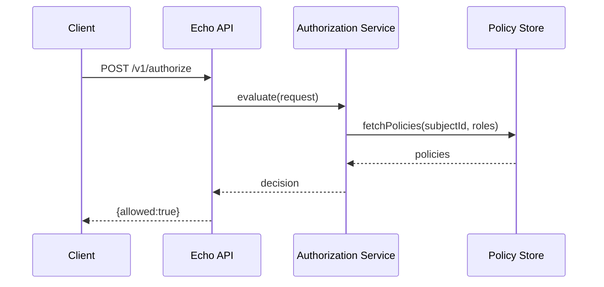

# RBAC Authorization Component Design

## Overview
The RBAC authorization service provides role- and permission-based access control for downstream services, exposes a secure API for role checks and policy administration, and follows the human-in-the-loop review gate before writing to any system of record [S1]. Error responses and any admin UI pieces must include labelled fields and screen-reader announcements to remain accessible [S2].

### Implementation Platform
- **Language & Framework:** Go with the Echo web framework for fast, strongly typed APIs and middleware support that suit the RBAC guardrail requirements.

## Component Breakdown
1. **API Layer (cmd/rbac-service)**
   - HTTP entry point with Echo, routing requests to use cases.
   - Middleware for authentication token parsing and context enrichment.
2. **Authorization Service (internal/authorization)**
   - Evaluates roles, permissions, and context data to allow/deny actions.
   - Loads policies from `pkg/policystore` cache and refreshes with watch support.
3. **Policy Store (pkg/policystore)**
   - Reads from persistent backing (mocked in-memory for tests) and provides query methods.
   - Emits events when policies change; allows gating before writes.
4. **Audit & Metrics (internal/audit)**
   - Records decisions for observability. Ensures any write attempts go through human review flow before applying [S1].
5. **Tests (tests/authorization)**
   - Unit tests for policy logic, middleware, and edge cases; integration tests verify REST flows.

## API Contract
### 1. `POST /v1/authorize`
- Purpose: Evaluate whether a subject can perform an action on a resource.
- Request:
  ```json
  {
    "subjectId": "user-123",
    "roles": ["editor"],
    "action": "article:update",
    "resource": "article:456"
  }
  ```
- Response 200:
  ```json
  {
    "allowed": true,
    "policiesEvaluated": ["editor-can-edit"],
    "message": "Access granted"
  }
  ```
- Response 403:
  ```json
  {
    "allowed": false,
    "reason": "Missing permission article:update",
    "message": "Access denied"
  }
  ```
- Accessibility note: client should announce `message` for screen readers [S2].

### 2. `GET /v1/policies`
- Lists all policies (paged). No real system of record writes.

### 3. `POST /v1/policies`
- Creates or updates a policy; requires review gate before persistence. Payload must include `review_id` referencing a human review token [S1].

### 4. `POST /v1/roles/{roleId}/permissions`
- Assign permissions to roles within RBAC store; writes gated by reviewing workflow [S1].

## Sequence Diagram


## Project structure
```
rbac-service/
├── cmd/
│   └── rbac-service/
│       └── main.go              # Echo bootstrap, middleware, route registration
├── internal/
│   ├── authorization/
│   │   ├── service.go           # Core evaluation logic
│   │   └── service_test.go      # Unit tests for service logic
│   ├── middleware/
│   │   └── auth.go              # Authentication, context decorator
│   └── audit/
│       └── recorder.go          # Writes audit entries (gated)
├── pkg/
│   └── policystore/
│       ├── store.go             # Policy persistence abstraction
│       └── store_mock.go        # In-memory implementation for tests
├── api/
│   └── openapi.yaml             # API contract reference
├── config/
│   └── config.yaml              # Service configuration (ports, policy refresh intervals)
├── tests/
│   └── integration/
│       └── authorize_flow_test.go# End-to-end authorization API tests
├── go.mod                        # Go module file
├── go.sum                        # Dependency checksums
├── README.md                     # Implementation guidance and running instructions
└── design.md                     # This document
```
